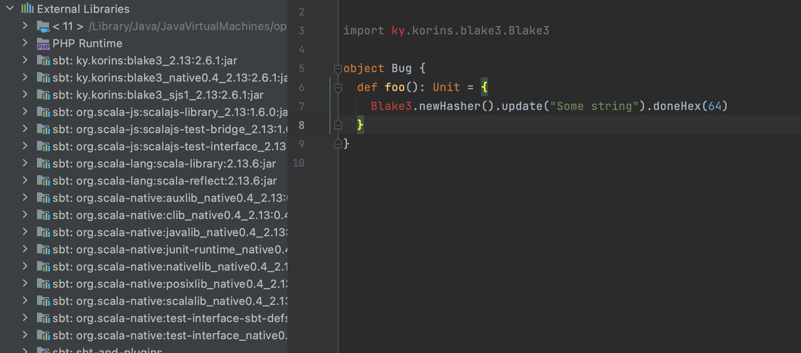

# IDEA sbt-crossproject Bug

Small example to support a claim of IDEA bug with sbt-crossproject.

Environment:
```
IntelliJ IDEA 2021.1.3 (Ultimate Edition)
Build #IU-211.7628.21, built on June 30, 2021
Runtime version: 11.0.11+9-b1341.60 x86_64
VM: OpenJDK 64-Bit Server VM by JetBrains s.r.o.
macOS 11.4
```

It is imported as:
